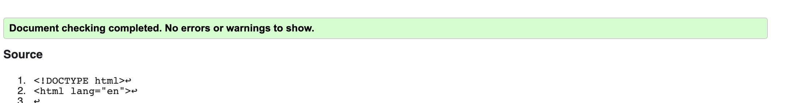
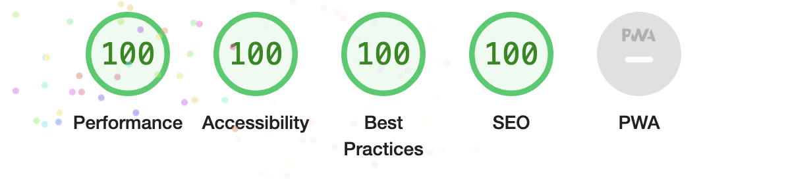

# Time for Quiz

***

It is a quiz application using HTML, CSS, and Javascript. This application emphasizes the use of Javascript to provide quiz questions and collect user data to determine whether the answers to a questions are correct, this then generates a score and appends a final page of results from the user data.
***
[Link for repository](https://github.com/Aliona83/project2/settings/pages)
## Contents
***
* Project Goals 
* Target Audience
* Existing Features
   * Home Page
   * Quiz Rules
   * Quiz
   * Result Page
* Technologies Used
* Design
    * Desktop
    * Tablets
    * Mobile
    * Typography
    * Colour scheme 
* Testing 
* Deployment using GitHub
* Creating a fork or Copying
* Clone
* Acknowledgments 
* Credits and References

### Project Goals
***
To create this project, I was inspired by the moment when approached my holidays. The idea came to me while we with family were decorating a Christmas tree. When creating this Quiz, I thought it not only for adults but also that this quiz would be interesting for children. Questions of various types were selected for both children and adults. This is such a family game that you can play on the Christmas holidays together with your friend and family.
I want Gamer players will be too easily understand the main purpose of the Quiz and learn something from the quiz.
  * As a creator, I want the user to have a simple interface.
  * As a creator I want the user will learn something new from the Quiz.
  * as a creator I want the user to be able to have an instruction section of the game.
  * As a creator I want the user of the game to be easy to manage and understand.

### Target Audience 
***
This project will help to remember some traditions, and facts about Christmas. The idea of this project is to bring the whole family together, and create a pleasant atmosphere and sense of celebration. I want that this game to be easy to understand how to play. And it would be easy to control this game first of all for kids. Each game has to be fun.
   * As a user, I want to be able to see the all question of the Quiz.
   * As a user, I want to be able to see the total number of questions.
   * As a user, I want to see the time remaining for each question.
   * As a user, I want to get fun and get new knowledges from this quiz.

### Existing Features
***
The game will be broken into three areas :
#### Home page :
* Title of Quiz game.

 * "Start Quiz" button
 
 * Quiz rules.
 
 Quiz rules tell how visiter have to play the game.
#### Game page 
* Display a randomly generated question for the user. Underneath each question has four choices with each of the possible correct answers.

* Button "next".User can go to next question.

* Timer for each question. Gamer player will have 20 seconds for each question.

* Score for user.

* Question number

* If the user forgot to select an answer, an alert pop up.

* If 20 seconds timer up,user will an alert pop up.

#### Result Page :

* Gamer will be able to see a final score.

* User will have the opportunity to play again, press button "play again".

### Technologies Used 
***
* HTML5 - basic coding to build  a website for Quiz.
* CSS3 - use for styling the website.
* Gitpod - used to create website and writing code.
* GitHub - to store and save the process and files used on the website.
* [Pexel](https://www.pexels.com/ru-ru/) - got background Christmas image for my Quiz game .
* [W3C Validator](https://validator.w3.org/) - to validate HTML.
* [W3C Jicsaw Validator](https://jigsaw.w3.org/css-validator/) - to validate CSS.
* Am I Responsive - was to used to create a shot to see responsiveness on different devices.
* [Jshint](https://jshint.com/)- to validate JqavaScript code.
* [Canva](https://www.canva.com/) - to create Wireframes.
* [Wave Chrome extension](https://wave.webaim.org/) - to check web accessibility.
## Design
***
#### Wireframes

I used Canva.com to create the wireframes for my Quiz. It should have a title and the Quiz rules on the main page of the Quiz. After pressing a button to Start Quiz user enters the page with quiz questions and answers, score, and timer. On the last page should be the User's results and Play again button.

My draft idea of what the site would look like is shows in the wireframes below.

### Typographhy 

 I used for text in this project from Google Font, I selected "Exo". This font style I used for all headings and for title. 

### Color palette

[color pallete](https://coolors.co/950952-5e0035-020202-023618-005c69

For this project, I choose colors that would fit the theme of Christmas.
I used the color scheme for the text only, as I had a Christmas background. 
Also, a color set was selected so that the user would be comfortable and visible. 
  
  * For the game title I used #691515, 
  * For h2  I used #5E0035 colour. 
  * Text for rules and answers for the question I used regular black color. 
  * For the score I used #005c69.
  * All buttons I made color #87c38f.
  * During the development of the site in a media query for mobile phones, I had to add background color, because of the background ornaments, the brightness of the letters disappeared #f9627d70.

## Testing 
***
 * No issues found

 * No issues found

* There I had some issues: The reason why quizData is an undefined variable is that the question for Quiz are in a seperate file(question.js)
Also during the check, it was found that some variables were written, but not used, I received the code and removed them, but in some places, I was missing semicolons.

 * The game has been tested on iPhone devices(iPhone 5, this phone has the smallest screen) also Ipad Air devices, and Samsung Galaxy S8+ phones and the last check had been done on a MacBook computer.

 
 * I checked the site with Wave. There no errors, but had 2 alerts. Should have to add fieldset tag for radio buttons.
 * Mobile and desktop Lighthouse
 
 

## Deployment using GitHub
***
  * Navigate to project repository.
  * Click on the Settings Tab.
  * Scroll down to page.
  * For the source, select main branch.
  * Click save.
  * Open the link provided by GitHub to go to the deployed website. Link is on the top of page.

  ## Creating a fork or Copying
  ***
  To clone/fork/copy the repository you click on the fork tab which is situated next to the page.

  ## Clone
  To create a clone you need:
  1. Click on the code tab, left of the Gitpod tab.
  2. To the right of the repository name, the click clipboard icon.
  3. In the IED open GitBash.
  4. Change the working directory to the location you prefer.
  5. Add Git Clone with the copy of the repositroy name.
  6. Clone has been created.

## Acknowledgments 
***
I am very acknowledgments to the Code Institute team who help me with this project. Also, Slack community, for motivating and always being there. To my mentor Rohit Sharma who help me to fix my mistakes, and explained everything smoothly.
 ## Credits and References
 ***
### Information Recources
* [Web Dev Simplified](https://www.youtube.com/watch?v=riDzcEQbX6k)
* [Stackoverflow](https://stackoverflow.com/)

